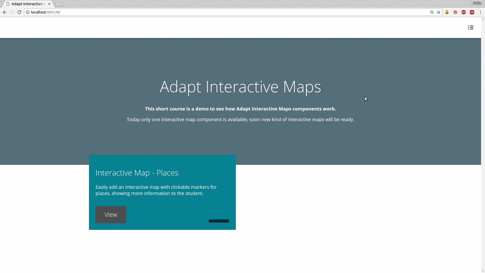

# Adapt Notes

**Display a Notes editor in the drawer panel of your AdaptLearning course**

<b>This extension is still under developement, will be available soon.</b>

    

**Support the development**

If you like this extension and you would like to adopt other kind of plugins
for your AdaptLearning course and authoring tool, please consider to support the development of new components. 

If you are interested, I'm <a href="https://it.linkedin.com/in/fabio-beoni-6a7848101">available for hire</a> to develop custom components for AdaptLearning courses.

----------------------------
**Version number:**  0.1
**Adapt Framework versions:**  >= 2.0
**Author:** <a href="https://it.linkedin.com/in/fabio-beoni-6a7848101" target="_blanck">Fabio Beoni</a>
